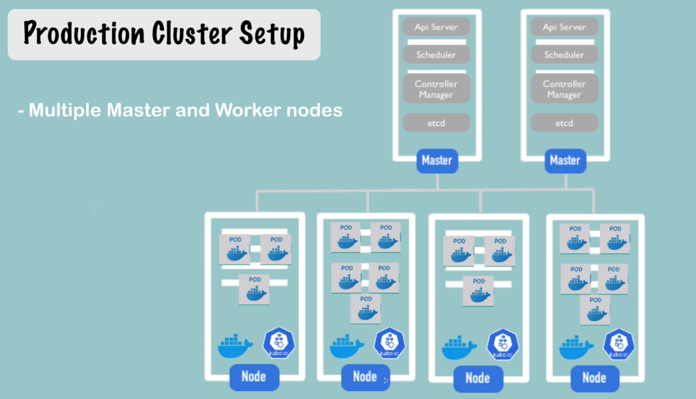

# Kubernetes

## What is Kubernetes?

- Open-source orchestration tool
- Developed by Google
- Helps you manage containerized applications in different enviornments (physical, virtual, cloud)

### What problems K8s solved?

- trend from monolith to microservices
- increased usage of containers
- demand for a proper way of managing that big number of hundreds (using scripts and handmade tools was exhausting, inefficient and hard to manage)

### What features it offers?

1. high availability or downtime
2. scalability or high performance
3. disaster recovery - backup and restore

### Basic K8s architecture

- one master node where some processes are running:

  - **api server** (it's a container) - entrypoint to k8s cluster. API server is the one with which K8s UI, API or CLI are communicating
  - **controller manager** - keeps track of what's happening in the cluster (whether some container has died or some repairment is needed)
  - **scheduler** - schedules containers on different nodes based on workload and available node resources
  - **etcd** - acts as a key value store keeping all the configuration, cluster state and data statuses (snapshots used to backup and restore are saved here)

- multiple worker nodes; on every worker node there is a kubelet process (primary "node agent") - k8s process that enables inter-node communication and running some tasks/processes
  - each worker has docker container of various applications deployed on it (that's where user apps are running)
- virtual network - used to enable the communication between the master and the worker nodes; practically it aggregates all the resources into one machine
- worker nodes are bigger and more powerful due to higher load
- master node must be backed up, otherwise if we loose it, access to cluster is not possible (usually two or more masters to enable HA)

## Basic concepts

- Pod: the smallest unit that can be configured, used and interacted with
  - pod is a wrapper for the container; one worker node contains multiple pods; but we can also have multiple containers in a single pod, but usually there is one pod per application
  - every pod has its own IP address, it is treated as an independent server
  - pods are communicating by using their internal IP addresses
  - K8s work only with pods
  - if a container stops or dies inside the pod, they will be restarted automatically
  - pods are ephemeral components, meaning they can die frequently; when a pod dies, a new one is created (they are recreated frequently, new IP address is assigned)
  - because those IP addresses can be changed frequently, it is very inconvenient to change those addresses when communicating between pods
  - a simpple alternative to that is using services which reside in pods. Service has two purposes:
    1. permanent IP address
    2. load balancer

### Kubernetes configuration

- all K8s requests go to master node (YAML or JSON format); declarative format of configuration

### K8s components

- Pod
- Service and Ingress

  - service:
    - permanent IP address
    - pod and service lifecycles are not bound, even if the pod dies, service will remain alive with the same IP address
    - external service: enables the communication from external sources (e.g. browser)
    - internal service: disable the communication from external service - e.g. the database could be an internal service
  - ingress - publicly available component to which we assign a domain address and all incoming requests from outside can go through ingress which will forward those requests to service

- ConfigMap
  - let's say we are using MongoDB. We built-in that URL to Docker image of the server app. MongoDB crashes and we have to change that value in our image:
    - rebuild the image
    - push it to repo
    - pull it down in pod
- ConfigMap - external configuration of the application
  - define a variable and that variable is visible and seen by a pod, any change of it
- Secret - like a ConfigMap, but used to store secret data (like credentials) in base64 encoded format
- Volumes - attaches a physical storage from a hard drive (local or remote storage) to a pod (so every data is permanently persisted, even if pod gets restarted)
- Deployment - to prevent downtime and support HA, we can have multiple nodes with the same pod that are using the same service (the same permanent IP address). Service will do the load balancing between pods (you can state the number of pod replicas); deployment is a blueprint for pod deployments
- StatefulSet - if we have stateful pods like database (we cannot load balance requests to database, because all db pods must use the same datastorage, meaning pods will have to use/access the same data). StatefulSet should be used in such cases, guarantees that db writes/reads are synchronized between the pods and prevents inconsistencies. Using StatefulSet to manage databases is tidious, so usually databases are kept outside of pods (outside of K8s cluster)

## Kubernetes architecture

### Worker node

- each node has multiple pods on it
- they do the actual work
- 3 processes must be installed on every worker node:
  - container runtime (e.g. Docker)
  - kubelet - interacts with the container and the node itself; starts the pod with a container inside and assigns resources to it
  - kube proxy - forwards requests from services to pods (intelligent routing logic, e.g. if a service calls a database, it will try using the database on the same pod if available to prevent inter-pod network hops)

### Master node

- 4 processes run on every master node that controls the whole cluster:
  - api server - like an api gateway, validates the request and does autn/z check and then forwards the request to other processes
  - scheduler - schedule a new pod on some worker node (based on resource needs and resources available on cluster nodes); scheduler just decides where to schedule a pod; once it is decided kubelet will actually start the pod
  - controller manager - detects state changes (e.g. pod crashes, it will try to reschedule that pod) and handles the cluster recovery
  - etcd - key-value store; every change in the cluster is stored in this store (application data will not be stored there)
- there are usually multiple master nodes (etcd is distributed storage)

## Benefits of Kubernetes - Scalability, High Availability, Disaster recovery

- High availability and scalability - multiple worker nodes containing the same pods. By redundancy HA is guaranteed. Since services are used to access those pods, requests to them are load balanced which ensures scalability.
- Ingress that accepts incoming requests are also pods (replicated as well)
- if some pods die, K8s will schedule their redeployment
- since all cluster changes are persisted in etcd, if some disaster happens, we can do the recovery by reading cluster/node/pod state.
- etcd backups are created (snapshots) and can be stored in the remote storage. We need to take care of creating those snapshots.
- application data is also stored in remote storage
- by using etcd snapshot and app data snapshots, cluster state can be restored
- we can also have backup cluster, to replace the one that has crashed (that can be expensive, especially for large clusters)

### K8s vs AWS

- advantages of K8s over AWS
  - replication is much easier
  - self-healing of K8s
  - smart scheduling (knows where to put a new pod)

## Minikube and Kubectl

### Minikube



- for local testing, instead of production-grade cluster, we use minikube
- minikube - open-source tool that operates as one-node cluster where master and worker processes run in the same node
- it comes preinstalled with Docker
- minikube creates a virtual box and in that VM a single node (cluster) is running (so, it requires virtualization to be turned on)
- use its CLI only to start/delete the cluster

### Kubectl

- a command line tool for k8s cluster
- very powerful (better than UI and API clients)
- minikube has a kubectl dependency

- Set VirtualBox as a default VM driver

```
minikube config set driver virtualbox
```

- Minikube status
  `minikube status`
- `kubectl status` - get status of K8s client and server
- Start minikube in debug mode `minikube start --alsologtostderr`
- Delete minikube cluster - `minikube delete`

## Basic kubectl commands

- Get status of the nodes <br>
  `kubectl get nodes`
- Get status of the pods
  `kubectl get pod/pods`
- Get status of the services
  `kubectl get services`

- Deployment - an abstraction over pods
  `kubectl create deployment NAME --image=image -- [COMMAND] [args...] [options]`

- Nginx deployment example (after this we will have a pod, the deployment will take care of that)

```
kubectl create deployment nginx-depl --image=nginx
```

- List deployments
  `kubectl get deployments`

- Get replicaset (sits in between the deployment and pods)
  `kubectl get replicaset`

- POD id format: `deploymen_id-replicaset_id-pod_id`

Layers of abstraction:

1. Deployment manages a...
2. ReplicaSet manages a...
3. Pod is an abstraction of
4. Container

- Everything below deployment is handled by Kubernetes

- Edit deployment (let's edit an image in the pod): `kubectl edit deployment nginx-depl` -> opens an auto-generated config file with default values. Update the value you want. When a deployment/pod is update, an old one is terminated and a new one is created

- Get pod logs - check what an application in the pod has logged:
  `kubectl logs <pod-name>`

- Get the details of a pod:
  `kubectl describe pod <pod-name>`

- Get the details of a service:
  `kubectl describe service <service-name>`
- Log into a terminal of a pod (container): `kubectl exec -it <pod-name> --bash`
- Delete deployment: `kubectl delete deployment <deployment-name>`

- Apply config: `kubectl apply -f <filename>` (can create or update the deployment)

## Kubernetes YAML file explained

- YAML config
- multiple configurations can be put in a single file (separated with `---`)
- every configuration file has 3 parts:

1. metadata (contains name of the service/deployment)
2. specification (attributes of spec are specific to the kind)
3. status - K8s get this (from etcd) and compare it with the desired state. If there is something to be done, it does it. AUtomatically generated by k8s

- Deployment spec has its own metadata and specification used to configure pods

- `kubectl get pods -o wide` -> prints a wide output when listing pods (stating ports as well)

- get deployment config status (3rd part of the config, status generated by K8s and retrieved from etcd):

```
kubectl get deployments nginx-deployment -o yaml
```

- If we want to copy a cluster config by extracting the deployment details with this command, **status part should be removed before starting the cluster**

- `kubectl delete -f <config-file>` - deletes a deployment/service by config file

## An example app

1. MongoExpress client sends a request to
2. MongoExpress External service that proxies a request to
3. MongoExpress pod which then sends a request to
4. MongoDB internal service which forwards it to
5. MongoDB pod

- `kubectl get all` get all components in the cluster
- `ConfigMap` is a centralized config that can be used by many deployments/services
- to assign an external IP address to external service in minikube: minikube service <name>

## Namespaces

- resources can be organized in namespaces
- namespace can be trated as a virtual cluster inside a cluster
- 4 namespaces are given by default

Default namespaces:

`kubernetes-dashboard` only with minikube

1. `kube-system` - do not create or modify in kube-system (not intended for client use); system processes
2. `kube-public` - the publicly accessible data; contains a configmap which contains cluster information (`kubectl cluster info` to retrieve it)
3. `kube-node-lease` - contains an info about heartbeats; each node has a lease object associated which determines the availability of that node
4. `default` - resource created by a user

- Create a namespace: `kubectl create namespace <ns-name>` (or use a namespace configuration file)
- Get namespaces: `kubectl get namespace`

### Why using namespaces?

1. having everything in one namespace is hard to manage
2. avoid conflicts with other teams (two teams have the deployments with the same name, but different configs, meaning one team will override the config of another team)
3. sharing resources (e.g. having staging and development, can reuse the same resource in one cluster, e.g. nginx)

- blue-green deployments (active and to become active), but using the same shared resource

4. access and resource limits - making isolated, secure environments with limitation of CPU, RAM, Storage per DNS etc (resource quotas)

- by doc: should not use namespaces for smaller projects with less than 10 users
- you can logically group resources into namespaces (database, elk, monitoring, nginx-ingress...)

### Characterics of namespaces:

1. you can't access most resources from another namespace (each NS must define own ConfigMap)
2. access service in another namespace (when referencing such service, add namespace at the end of a service name `service.namespace`)
3. components which cannot be created in namespace (live globally in cluster, not in namespace):
   - volume
   - node

- those resources can be listed with `kubectl api-resources --namespaced=false`
- when a namespace is not stated, the default one is used
  `kubectl apply -f <filename.yml> --namespace=<ns-name>`
- another way is to set namespace name in config file: `metadata.namespace: <name>` - better way

- Get components from a particular namespace: `kubectl get <resource-type> -n <namespace-name>`
- change the active namespace with `kubens` (has to be installed - https://github.com/ahmetb/kubectx#installation)
- `kubens` - list namespaces
- `kubens <namespace-name>` - changes the default namespace

## Ingress

- When you have a cluster with pod and a service, you can access it outside by using an external service (by its IP and port)
- if you want to use the domain name, you should use ingress and then we can have an internal service instead

- Host:
  - valid domain name address
  - map domain name to Node's IP address, which the entrypoint of the cluster
- Ingress needs an implementation - Ingress controller. Ingress controller is a separate pod which does evaluation and processes ingress rules. That is an entrypoint to cluster. There are many 3rd-party implementations
- you can run your cluster in cloud provider env so we will have a cloud load balancer that will redirect traffic to ingress; it can also be some proxy server that will route traffic to ingress controller

- installing ingress in minikube - `minikube addons enable ingress` - it automatically configures/starts the K8s Nginx implementation of Ingress controller

```
minikube start --driver=docker --vm=true
minikube start --driver=docker --cpus 2 --memory 4096
minikube addons enable ingress
```

- Creating a kubernetes-dashboard namespace: `minikube dashboard`
- `kubectl get all -n kubernetes-dashboard`
- Get ingress: `kubectl get ingress -n kubernetes-dashboard` (if we add `--watch` it will watch for changes)
- after ingress is created and an IP address is assigned, we should add that mapping `IP address dashboard.com` to `/etc/hosts`. When we type `dashboard.com` it will:

1. redirect it to ingress
2. ingress will proxy it to an internal service
3. internal service will forward it to pod (K8S dashboard)

- Describe ingress: `kubectl describe ingress dashboard-ingress -n kubernetes-dashboard`
- there is a default backend serving paths that do not have rules defined for them (it can be overriden)

### Ingress use cases

- Multiple paths for the same host -> Google has one domain, but many services it is offering (you can have one domain in Ingress with different paths being served by different services)
- Multiple sub-domains or domains

### TLS certificate

```yml
apiVersion: networking.k8s.io/v1beta1
kind: Ingress
metadata:
  name: tls-example-ingress
spec:
  tls:
    - hosts:
        - myapp.com
        secretName: myapp-secret-tls
  rules:
    - host: myapp.com
      http:
        paths:
          - path: /
            backend:
              serviceName: my-app-internal-service
              servicePort: 8080
```

```yml
apiVersion: v1
kind: Secret
metadata:
  name: my-app-secret-tls
  # secret must be in the same namespace as the service that will use it
  namespace: default
data:
  # values, not paths
  tls.crt: base64 encoded cert value
  tls.key: base64 encoded key value
type: kubernetes.io/tls
```

## Helm

- Package Manager for Kubernetes (apt, yum or brew for K8s)
- package YAML files and distribute them in public and private repositories
- a bundle of YAML files is called Helm Chart; you can push them to Helm Repository
- database and monitoring apps usually have Helm charts (complex config)
- Helm supports template engine - e.g. you have a microservice architecture and all services have a similar yaml configuration - name and Docker image are different; Helm helpes with:
  - creating a common blueprint
  - dynamic values are replaced by placeholders

```
apiVersion: v1
kind: Pod
metadata:
  name: {{ .Values.name }}
spec:
  containers:
    - name: {{ .Values.container.name }}
  image: {{ .Values.container.image }}
  port: {{ .Values.container.port }}
```

- `values.yaml`

```
name: my-app
container:
  name: my-app-container
  image: my-app-image
  port: 9001
```

- Values defined either via yaml file or with `--set` flag
- templating engine feature is useful in CI/CD
- use case: same applications accross different environments

#### Helm chart structure

- directory structure - top level folder = name of chart
- `Chart.yaml` - metainfo about the chart (name, version, dependencies)
- `values.yaml` - values for the template files (the default values you can override)
- `charts` - folder containing chart dependencies
- `templates` folder - the actual template files
- Commands

```
# search Helm charts
helm search <keyword>

# deploy Helm charts
helm install <chartname>
# template files will be filled with the values from values.yaml

# Providing an alterantive values YAML file which will override values present in values.yaml file
helm install --values=<file.yaml> <chartname>
# or setting the variable explicitly when installing yaml files
helm install --set version=2.0.0 <chartname>
# applying upgrade to existing deployments
helm upgrade <chartname>
# rollback the upgrade
helm rollback <chartname>
```

#### Release management

- Helm 2 has a client-server architecture (Helm client and server)
- Server is called Tiller
- `helm install <chartname>` is hitting Tiller which has to run in K8s cluster and Tiller will execute the request and create the components
- Tiller will maintain the history of the executions creating the revision history by that
- Tiller is too poweful (has a strong permission list)
- in Helm 3 it has been removed

## Pods and containers - K8s networking

- why is a pod abstraction is useful
- Pod = solving the port allocation problem
- every pod has a unique IP address and that IP address is reachable from all other pods in the K8s cluster
- pods solves the problem with the problem allocation and mapping from host to container ports (multiple pods are running in the same node)
- pods owns a network namespace; it has a virtual ethernet connection where pod is a host
- pods have address ranges that they can allocate to its containers
- if the container runtime is changed, config stays the same. Pod will abstract that change (e.g. from Docker to Vagrant)

- When do we need multiple containers in the same pod?
  > when you have a sidecar container to help your main container
- How do containers communicate inside the Pod?
  - it is an isolated virtual host (has its own network namespace), so containers can talk to each other on localhost (just targetting the right port)
- in each pod, there is a "pause" container - sandbox container. Its only purpose is to reserve and hold network namespace. If the main container dies, it will get recreated, but the IP address will stay the same thanks to this sandbox container. If the pod dies, it will get a new IP address.

```bash
# prints the VM Docker environment
echo $(minikube docker-env)
# will connect to remote Docker host
eval $(minikube docker-env)
# docker ps to check the existing containers
```

## Kubernetes volumes

1. Persistent volume
2. Persistent volume claim
3. Storage class

Needs:

1. having a storage component independent of the pod lifecycle (recreated after termination etc.)
2. storage must be available on all nodes
3. storage needs to survive even if cluster crashes

### Persistent volume

- a cluster resource
- created via YAML file
- needs an actual physical storage local or remote storage (maintained by a dev or admin; better option)

```yaml
apiVersion: v1
kind: PersistentVolume
metadata:
  name: pv-name
spec:
  capacity:
    storage: 5Gi
  volumeMode: Filesystem
  accessModes:
    - ReadWriteOnce
  persistentVolumeReclaimPolicy: Recycle
  storageClassName: slow
  mountOptions:
    - hard
    - nfsvers=4.0
  nfs:
    path: /dir/path/on/nfs/server
    server: nfs-server-ip-address
```

An example with Google Cloud storage:

```yaml
apiVersion: v1
kind: PersistentVolume
metadata:
  name: test-name
  labels:
    failure-domain.beta.kubernetes.io/zone: us-central1-a__us-central1-b
spec:
  capacity:
    storage: 400Gi
  accessModes:
    - ReadWriteOnce
  gcePersistentDisk:
    pdName: my-data-disk
    fsType: ext4
```

Local storage:

```yaml
apiVersion: v1
kind: PersistentVolume
metadata:
  name: example-pv
spec:
  capacity:
    storage: 100Gi
  volumeMode: Filesystem
  accessModes:
    - ReadWriteOnce
  persistentVolumeReclaimPolicy: Delete
  storageClassName: local-storage
  local:
    path: /mnt/disks/ssd1
  nodeAffinity:
    required:
      nodeSelectorTerms:
        - matchExpressions:
            - key: kubernetes.io/hostname
              operator: In
              values:
                - example-node
```

-**NOTE**: persistent volumes are not namespaced

- Persistent volume claim: a way for an app to claim some volume

```yaml
kind: PersistentVolumeClaim
apiVersion: v1
metadata:
  name: pvc-name
spec:
  storageClassName: manual
  volumeMode: Filesystem
  accessModes:
    - ReadWriteOnce
  resources:
    requests:
      storage: 10Gi
```

- Use that PVC in pod configuration:

```yaml
volumes:
  - name: mypd
    persistentVolumeClaim:
      claimName: pvc-name
```

1. pods requests the volume through the PV claim
2. claim tries to find a volume in cluster
3. volume has the actual storage backend

- Claims must exist in the same namespace (as the pod using it)
- once the claim is available to a pod, it can be used as a volume that can be mounted by the containers from that pod

## ConfigMap and Secret

- local volumes managed by Kubernetes
- config file, certificate file ->

  - create ConfigMap and/or Secret component
  - mount that into your pod/container

- Storage class
  - provisions persistent volumes dynamically when PersistentVolumeClaim claims it

```yml
apiVersion: storage.k8s.io/v1
kind: StorageClass
metadata:
  name: storage-class-name
provisioner: kubernetes.io/aws-ebs
parameters:
  type: io1
  iopsPerGb: "10"
  fsType: ext4
```

1. pods claims storage via PVC
2. PVC requests storage from SC
3. SC creates PV that meets the needs of the Claim
